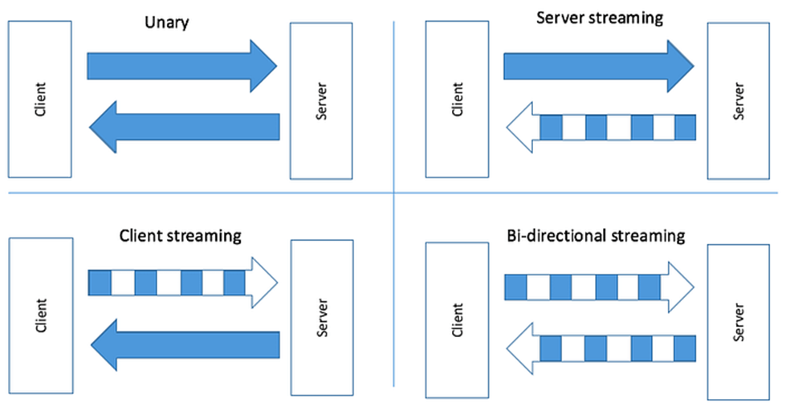

<h1>Distributed System Google Remote Procedure Call gRPC </h1>

  Asmae EL HYANI  Distributed System & Artificial Intelligence Master’s  ENSET Mohammedia

   
<h2>Introduction</h2>

Google Remote Procedure Call (gRPC) is an open-source remote procedure call (RPC) framework developed by Google. 
It is a high-performance and lightweight framework for building distributed systems, allowing clients and servers 
to communicate transparently and efficiently.  gRPC uses Protocol Buffers (protobuf) as its default interface definition 
language (IDL), which allows for efficient serialization and deserialization of data across different languages and platforms. 
This makes it easier to develop and maintain cross-platform applications with different programming languages. 
 gRPC supports multiple programming languages, including C++, Java, Python, Go, C#, Ruby, and more. It also supports 
different types of communication patterns, including unary, server streaming, client streaming, and bidirectional 
streaming.

In this assignment, we will go over the basics of gRPC, how to use it to build a chat application between many 
clients, and we will apply that using Java language.

    
<ol type="I">
  <h2><li >gRPC communication patterns (models).</li></h2>
 <ol type="1">
<h3><li>gRPC proto file</li></h3>
    <pre style="background-color:#3b3535;color:white;">
    syntax= "proto3";
    option java_package="ma.enset.stubs";  //to specify where we gonna add the class
    service BankService{
        rpc convert(ConvertCurrencyRequest) returns(ConvertCurrencyResponse);  //unary model
        rpc getCurrencyStream(ConvertCurrencyRequest ) returns (stream ConvertCurrencyResponse);   //server streaming model
        rpc performStream(stream ConvertCurrencyRequest ) returns (ConvertCurrencyResponse);   //client streaming model
        rpc fullStream(stream ConvertCurrencyRequest ) returns (stream ConvertCurrencyResponse);   //Bidirectional streaming model
        }
    message ConvertCurrencyRequest{
        string currencyFrom=1;
        string currencyTo=2;
        double  amount=3;
    }
    message ConvertCurrencyResponse{
        string currencyFrom=1;
        string currencyTo=2;
        double amount=3;
        double result=4;
    }
    </pre>

<h3><li>gRPC services</li></h3>
   <h4>Unary Streaming<h4>
    <pre style="background-color:#3b3535;color:white;">
    @Override
    public void convert(Bank.ConvertCurrencyRequest request, StreamObserver<Bank.ConvertCurrencyResponse> responseObserver) {
        //get data
        String currentFrom=request.getCurrencyFrom();
        String currentTo=request.getCurrencyTo();
        double amount=request.getAmount();
        //send request
        Bank.ConvertCurrencyResponse response= Bank.ConvertCurrencyResponse.newBuilder()
                .setCurrencyFrom(currentFrom)
                .setCurrencyTo(currentTo)
                .setAmount(amount)
                .setResult(amount*11.56)
                .build();
        responseObserver.onNext(response);
        responseObserver.onCompleted();
    }
    </pre>
    <h4>Server Streaming<h4>
    <pre style="background-color:#3b3535;color:white;">
    @Override
    public void getCurrencyStream(Bank.ConvertCurrencyRequest request, StreamObserver<Bank.ConvertCurrencyResponse> responseObserver) {
        //get data
        String currencyFrom= request.getCurrencyFrom();
        String currencyTo = request.getCurrencyTo();
        double amount= request.getAmount();
        Timer timer=new Timer();
        timer.schedule(new TimerTask() {
            int count=0;
            @Override
            public void run() {
                Bank.ConvertCurrencyResponse response= Bank.ConvertCurrencyResponse.newBuilder()
                        .setCurrencyFrom(currencyFrom)
                        .setCurrencyTo(currencyTo)
                        .setAmount(amount)
                        .setResult(amount*Math.random()*100)
                        .build();
                responseObserver.onNext(response);
                count++;
                if(count==10){
                    responseObserver.onCompleted();
                    timer.cancel();
                }
            }
        }, 1000, 1000);
    }
    </pre>
    <h4>Client Streaming<h4>
    <pre style="background-color:#3b3535;color:white;">
    @Override
    public StreamObserver<Bank.ConvertCurrencyRequest> performStream(StreamObserver<Bank.ConvertCurrencyResponse> responseObserver) {
        return new StreamObserver<Bank.ConvertCurrencyRequest>() {
            double sum=0;
            @Override
            public void onNext(Bank.ConvertCurrencyRequest convertCurrencyRequest) {
                sum+=convertCurrencyRequest.getAmount();
            }
            @Override
            public void onError(Throwable throwable) {
            }
            @Override
            public void onCompleted() {
                Bank.ConvertCurrencyResponse response=Bank.ConvertCurrencyResponse.newBuilder()
                        .setResult(sum)
                        .build();
                responseObserver.onNext(response);
                responseObserver.onCompleted();
            }
        };
    }
    </pre>
    <h4>Bi-Directional Streaming<h4>
    <pre style="background-color:#3b3535;color:white;">
    @Override
    public StreamObserver<Bank.ConvertCurrencyRequest> fullStream(StreamObserver<Bank.ConvertCurrencyResponse> responseObserver) {
        return new StreamObserver<Bank.ConvertCurrencyRequest>() {
            @Override
            public void onNext(Bank.ConvertCurrencyRequest convertCurrencyRequest) {
                Bank.ConvertCurrencyResponse response= Bank.ConvertCurrencyResponse.newBuilder()
                        .setCurrencyFrom(convertCurrencyRequest.getCurrencyFrom())
                        .setCurrencyTo(convertCurrencyRequest.getCurrencyTo())
                        .setAmount(convertCurrencyRequest.getAmount())
                        .setResult(convertCurrencyRequest.getAmount()*Math.random()*40)
                        .build();
                responseObserver.onNext(response);
            }
            @Override
            public void onError(Throwable throwable) {
            }
            @Override
            public void onCompleted() {
                responseObserver.onCompleted();
            }
        };
    }
}
    </pre>
    
    
<h3><li>gRPC server</li></h3>
    <pre style="background-color:#3b3535;color:white;">
public class GrpcServer {
    public static void main(String[] args) throws Exception{
        Server server = ServerBuilder.forPort(5555)
            .addService(new BankGrpcService())
            .build();
        server.start();
        server.awaitTermination();
    }
}
    </pre>
    
    
<h3><li>gRPC clients</li></h3>
    <h5>Unary Streaming</h5>
    <pre style="background-color:#3b3535;color:white;">
public class BankGrpcClient2 {
    public static void main(String[] args) throws IOException {
        ManagedChannel managedChannel= ManagedChannelBuilder.forAddress("localhost",5555)
                .usePlaintext()
                .build();
        BankServiceGrpc.BankServiceStub asyncStub = BankServiceGrpc.newStub(managedChannel);
        Bank.ConvertCurrencyRequest request= Bank.ConvertCurrencyRequest.newBuilder()
                .setCurrencyFrom("MAD")
                .setCurrencyTo("USD")
                .setAmount(6500)
                .build();
        Bank.ConvertCurrencyResponse response = asyncStub.convert(request, new StreamObserver<Bank.ConvertCurrencyResponse>() {
            @Override
            public void onNext(Bank.ConvertCurrencyResponse convertCurrencyResponse) {
                System.out.println("***********************");
                System.out.println(convertCurrencyResponse);
                System.out.println("***********************");
                }
            @Override
            public void onError(Throwable throwable) {
                System.out.println(throwable.getMessage());
            }
            @Override
            public void onCompleted() {
                System.out.println("END...");
            }
        });   
        System.out.println("......?");
        System.in.read();
    }
}
    </pre>

<h5>Server Streaming</h5>
    <pre style="background-color:#3b3535;color:white;">
public class BankGrpcClient3 {
    public static void main(String[] args) throws IOException {
        ManagedChannel managedChannel= ManagedChannelBuilder.forAddress("localhost",5555)
                .usePlaintext()
                .build();
        BankServiceGrpc.BankServiceStub asyncStub = BankServiceGrpc.newStub(managedChannel);
        Bank.ConvertCurrencyRequest request= Bank.ConvertCurrencyRequest.newBuilder()
                .setCurrencyFrom("MAD")
                .setCurrencyTo("USD")
                .setAmount(6500)
                .build();
        asyncStub.getCurrencyStream(request, new StreamObserver<Bank.ConvertCurrencyResponse>() {
            @Override
            public void onNext(Bank.ConvertCurrencyResponse convertCurrencyResponse) {
            System.out.println("*************************");
            System.out.println(convertCurrencyResponse);
            System.out.println("*************************");
            }
           @Override
           public void onError(Throwable throwable) {
               System.out.println(throwable.getMessage());
           }
           @Override
           public void onCompleted() {
               System.out.println("END......!");
           }
       });
        System.out.println("......?");
        System.in.read();
    }
}
    </pre>

<h5>Client Streaming</h5>
    <pre style="background-color:#3b3535;color:white;">
public class BankGrpcClient4 {
    public static void main(String[] args) throws IOException {
        ManagedChannel managedChannel= ManagedChannelBuilder.forAddress("localhost",5555)
                .usePlaintext()
                .build();
        BankServiceGrpc.BankServiceStub asyncStub =BankServiceGrpc.newStub(managedChannel);
        Bank.ConvertCurrencyRequest request=Bank.ConvertCurrencyRequest.newBuilder()
                .setCurrencyFrom("MAD")
                .setCurrencyTo("USD")
                .setAmount(6500)
                .build();
        StreamObserver<Bank.ConvertCurrencyRequest> performStream = asyncStub.performStream(new StreamObserver<Bank.ConvertCurrencyResponse>() {
            @Override
            public void onNext(Bank.ConvertCurrencyResponse convertCurrencyResponse) {
                System.out.println("--------------------");
                System.out.println(convertCurrencyResponse);
                System.out.println("--------------------");
            }
            @Override
            public void onError(Throwable throwable) {
                System.out.println(throwable.getMessage());
            }
            @Override
            public void onCompleted() {
                System.out.println("End......!");
            }
        });
        Timer timer=new Timer();
        timer.schedule(new TimerTask() {
            int counter=0;
            @Override
            public void run() {
                double nbr=Math.random()*100;
                Bank.ConvertCurrencyRequest currencyRequest= Bank.ConvertCurrencyRequest.newBuilder()
                        .setAmount(nbr)
                        .build();
                performStream.onNext(currencyRequest);
                ++counter;
                System.out.println("--------"+counter+"-----------");
                System.out.println("======> number = "+nbr);
                if(counter==20){
                    performStream.onCompleted();
                    timer.cancel();
                }
            }
        }, 1000, 1000);
        System.out.println(".....?");
        System.in.read();
    }
}
    </pre>
<h5>Bi-directional Streaming</h5>
    <pre style="background-color:#3b3535;color:white;">
public class BankGrpcClient5 {
    public static void main(String[] args) throws IOException {
        ManagedChannel managedChannel= ManagedChannelBuilder.forAddress("localhost",5555)
                .usePlaintext()
                .build();
        BankServiceGrpc.BankServiceStub asyncStub =BankServiceGrpc.newStub(managedChannel);
        Bank.ConvertCurrencyRequest request=Bank.ConvertCurrencyRequest.newBuilder()
                .setCurrencyFrom("MAD")
                .setCurrencyTo("USD")
                .setAmount(6500)
                .build();
        StreamObserver<Bank.ConvertCurrencyRequest> fullStream = asyncStub.fullStream(new StreamObserver<Bank.ConvertCurrencyResponse>() {
            @Override
            public void onNext(Bank.ConvertCurrencyResponse convertCurrencyResponse) {
                System.out.println("--------------------");
                System.out.println(convertCurrencyResponse);
                System.out.println("--------------------");
            }
            @Override
            public void onError(Throwable throwable) {
                System.out.println(throwable.getMessage());
            }
            @Override
            public void onCompleted() {
                System.out.println("End......!");
            }
        });
        Timer timer=new Timer();
        timer.schedule(new TimerTask() {
            int counter=0;
            @Override
            public void run() {
                double nbr=Math.random()*100;
                Bank.ConvertCurrencyRequest currencyRequest= Bank.ConvertCurrencyRequest.newBuilder()
                        .setAmount(nbr)
                        .build();
                fullStream.onNext(currencyRequest);
                ++counter;
                System.out.println("Stream "+counter);
                System.out.println("======> number = "+nbr);
                if(counter==20){
                    fullStream.onCompleted();
                    timer.cancel();
                }
            }
        }, 1000, 1000);
        System.out.println(".....?");
        System.in.read();
    }
}
    </pre>
  
  <h3><li>Source Code</li></h3>
  <a href="https://github.com/AsmaeEl23/gRPC_P1">click to see the source code</a>
  <h3><li>Test</li></h3>
  <ul type="square">
  <h3><li>BloomRPC Client</li></h3>
  <h4>Unary Streaming</h4>
  
  <h4>Server Streaming</h4>
  
  <h4>Client Streaming</h4>
  
  <h4>Bi-Directional Streaming</h4>
  

  <h3><li>Java Client</li></h3>
  <h4>Unary Streaming</h4>
  
  <h4>Server Streaming ------- Client Streaming ------- Bi-Directional Streaming</h4>
  
  </ul>
 </ol>
  
<h2><li>gRPC chat application.</li></h2>
<ol type="1">
  <h3><li>gRPC proto file</li></h3>
    <pre style="background-color:#3b3535;color:white;">
        syntax= "proto3";
        option java_package="ma.enset.stubs"; 
        service ChatService{
            rpc fullStream(stream Message ) returns (stream Message);  
            }
        message Message{
            string messageFrom=1;
            string messageTo=2;
            string content=3;
        }
</pre>
  <h3><li>gRPC chat service</li></h3>
    <pre style="background-color:#3b3535;color:white;">
public class ChatServerImp extends ChatServiceGrpc.ChatServiceImplBase {
   HashMap<'String,StreamObserver<'Chat.Message>> clients=new HashMap<>();
   @Override
   public StreamObserver<'Chat.Message> fullStream(StreamObserver<'Chat.Message> responseObserver) {
       return new StreamObserver<'Chat.Message>() {
           @Override
           public void onNext(Chat.Message message) {
               String messageFrom = message.getMessageFrom();
               String messageTo = message.getMessageTo();
               if(!clients.containsKey(messageFrom)){
                   clients.put(messageFrom,responseObserver);
               }
               if (clients.containsKey(messageTo) && !messageTo.equals("")){
                   StreamObserver<'Chat.Message> messageStreamObserver= clients.get(messageTo);
                   messageStreamObserver.onNext(message);
               }
           }
           @Override
           public void onError(Throwable throwable) {
           }
           @Override
           public void onCompleted() {
               responseObserver.onCompleted();
           }
       };
}
}</pre>
  <h3><li>gRPC chat server</li></h3>
    <pre style="background-color:#3b3535;color:white;">
public class GrpcServer {
    public static void main(String[] args) throws Exception{
        Server server = ServerBuilder.forPort(5555)
                .addService(new ChatServerImp())
                .build();
        server.start();
        server.awaitTermination();
    }
}
    </pre>
  <h3><li>gRPC chat client</li></h3>
    <pre style="background-color:#3b3535;color:white;">
public class ChatClient {
    public static void main(String[] args) throws IOException {
        ManagedChannel managedChannel= ManagedChannelBuilder.forAddress("localhost",5555)
                .usePlaintext()
                .build();
        ChatServiceGrpc.ChatServiceStub asyncStub = ChatServiceGrpc.newStub(managedChannel);
        Scanner sc = new Scanner(System.in);
        System.out.println("Enter your name : ");
        String clientName= sc.nextLine();
        System.out.println(clientName+" connected ....");
        StreamObserver<'Chat.Message> send = asyncStub.fullStream(new StreamObserver<'Chat.Message>() {
            @Override
            public void onNext(Chat.Message message) {
                String messageFrom= message.getMessageFrom();
                String content =message.getContent();
                System.out.println(messageFrom+" : "+content);
            }
            @Override
            public void onError(Throwable throwable) {
                System.out.println(throwable.getMessage());
            }
            @Override
            public void onCompleted() {
                System.out.println("End......!");
            }
        });
        Chat.Message req=Chat.Message.newBuilder()
                .setMessageFrom(clientName)
                .setMessageTo("")
                .setContent("")
                .build();
        send.onNext(req);
        while (true){
            System.out.println("===================");
            System.out.println("Message : ");
            String message=sc.nextLine();
            System.out.println("Send to : ");
            String to=sc.nextLine();
            Chat.Message request=Chat.Message.newBuilder()
                    .setMessageFrom(clientName)
                    .setMessageTo(to)
                    .setContent(message)
                    .build();
            send.onNext(request);
        }
    }
}
</pre>
<h3><li>Source Code</li></h3>
<a href="https://github.com/AsmaeEl23/chat_grpc_TP">click to see the source code</a>
<h3><li>Test</li></h3>
<h4>With java client</h4>

<h4>With bloomRPC client</h4>

</ol>
<h2><li>Magic number Game with gRPC.</li></h2>
</ol>
<h2>Conclusion.</h2>

We can devlope a beautiful chat application, using javaFX and what we learned from this homework  

